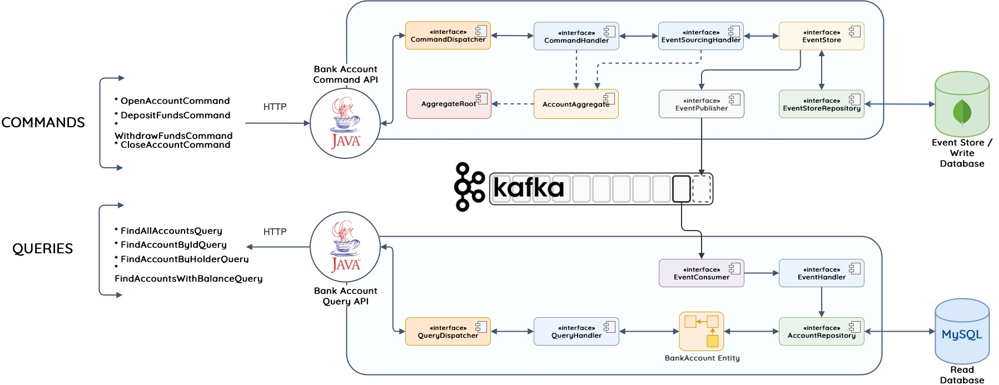

README.md




To set up, run `docker-compose up -d` to start kafka and zookeeper

mysql
```
docker run -it -d --name mysql-container -p 3306:3306 --network techbankNet -e MYSQL_ROOT_PASSWORD=techbankRootPsw --restart always -v mysql_data_container:/var/lib/mysql mysql:latest
```

adminer
```
docker run -it -d --name adminer -p 8080:8080 --network techbankNet -e ADMINER_DEFAULT_SERVER=mysql-container --restart always adminer:latest
```
mongoDB
```
docker run -it -d --name mongo-container -p 27017:27017 --network techbankNet --restart always -v mongodb_data_container:/data/db mongo:latest
```


start both Command and Query project

MySQL as the database for query

`http://localhost:8080/?server=mysql-container&username=root&db=bankAccount&select=bank_account`

username: `root`
password: `techbankRootPsw`

MongoDB as the event store by Command project

endpoint: `localhost:27017`


POST `http://localhost:5000/api/v1/openBankAccount`
```
{
"accountHolder": "John doe",
"accountType": "SAVINGS",
"openingBalance": 50.0
}
```


DELETE `http://localhost:5000/api/v1/closeBankAccount/aa216923-1123-4bcd-872a-c623f171aa29`


PUT `http://localhost:5000/api/v1/depositFunds/0471a0c4-8d17-4ea8-b4cb-7a7b82c4c90b`
```{
"amount":  150.0
}
```


PUT `http://localhost:5000/api/v1/withdrawFunds/0471a0c4-8d17-4ea8-b4cb-7a7b82c4c90b`
```
{
    "amount":  99.0
}
```


All Account lookup
GET `http://localhost:5001api/v1/bankAccountLookup/`

Specific Account by Id
GET `http://localhost:5001/api/v1/bankAccountLookup/byId/0471a0c4-8d17-4ea8-b4cb-7a7b82c4c90b`

Specific Account by Name
GET `http://localhost:5001/api/v1/bankAccountLookup/byHolder/John doe`

Specific Account by Balance
GET `http://localhost:5001/api/v1/bankAccountLookup/withBalance/GREATER_THAN/1`

Restore DB
POST `http://localhost:5000/api/v1/restoreReadDb`